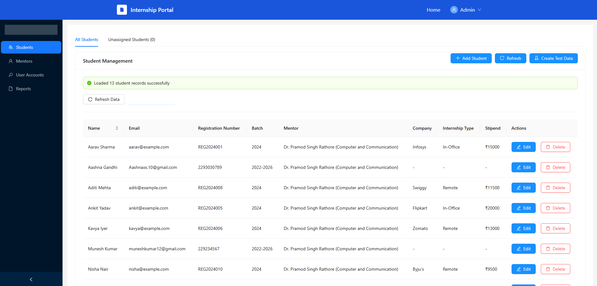
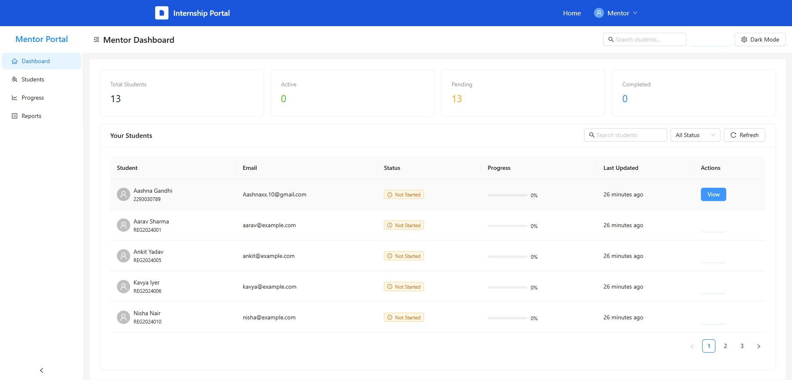
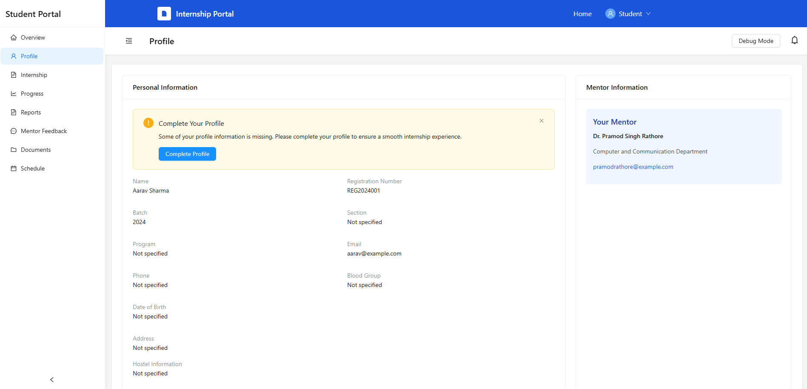

Internship Portal

Project Overview

Internship Portal is a comprehensive platform designed to streamline and enhance the management of student internships in colleges and universities. As internships have become a crucial part of higher education, institutions face increasing challenges in tracking student progress, ensuring compliance, and maintaining effective communication between students, mentors, and administrators.

Why Do Colleges Need This Portal?

- Centralized Management: Traditional internship management often relies on scattered spreadsheets, emails, and manual paperwork, making it difficult to track student placements, progress, and feedback. This portal brings all stakeholders onto a single, organized platform.
- Transparency & Accountability: The portal ensures that every step of the internship process is documented and visible to students, mentors, and administrators, reducing the risk of miscommunication or lost information.
- Efficient Communication: Built-in messaging and feedback features foster timely and structured communication between students and mentors, helping students receive the guidance they need.
- Automated Reporting: Students can submit weekly, monthly, and final reports directly through the portal, while mentors and admins can review and approve them efficiently. This reduces administrative overhead and ensures compliance with academic requirements.
- Progress Tracking: Both students and mentors can monitor internship milestones, deadlines, and overall progress, making it easier to identify and address issues early.
- Document Repository: The portal provides a secure space for uploading and accessing important documents, templates, and guidelines, ensuring everyone has the resources they need.
- Scalability: As the number of students and internships grows, the portal can easily scale to accommodate more users and data without sacrificing performance or usability.

Who Benefits from the Internship Portal?

- Students: Gain clarity on their internship requirements, deadlines, and feedback, and have a single place to manage all internship-related activities.
- Mentors: Can efficiently oversee multiple students, provide timely feedback, and track each student's progress without administrative hassle.
- Administrators: Have a bird's-eye view of all ongoing internships, can generate reports for accreditation or compliance, and ensure that institutional standards are met.

In summary, the Internship Portal transforms the internship experience for educational institutions by making the process more organized, transparent, and effective for everyone involved.

📸 Project Screenshot
![Internship Portal Screenshot]

🚀 How to Run This Project

1. Backend Setup

- Navigate to the project root directory.
- (Optional) Create and activate a virtual environment:
  python -m venv venv
  venv\Scripts\activate  # On Windows
  source venv/bin/activate  # On Mac/Linux
- Install backend dependencies:
  pip install -r requirements.txt
- Start the backend server:
  python app.py
  The backend will run on http://localhost:5000

2. Frontend Setup

- Navigate to the frontend directory:
  cd frontend
- Install frontend dependencies:
  npm install
- Start the frontend server:
  npm start
  The frontend will run on http://localhost:3000

🧑‍💼 Admin Dashboard Features

- Student Management
  - View, add, edit, and delete student records
  - Assign mentors to students
  - Filter/search students
  - View student progress and reports
- Mentor Management
  - View, add, edit, and remove mentors
  - Assign students to mentors
  - Manage mentor details
- User Accounts
  - Manage admin, mentor, and student user accounts
  - Reset passwords and manage roles
- Reports
  - View all student reports (weekly, monthly, final)
  - Filter reports by date range and type
  - Export/download reports
  - View report submission and approval statistics

🧑‍🏫 Mentor Dashboard Features

- Dashboard Overview
  - View statistics: total students, active, pending, completed
  - Quick search and filter for students
- Student Management
  - View list of assigned students
  - Access detailed student profiles
  - Track student progress and status
  - Open student details in a new tab
- Progress Tracking
  - (Coming soon) Visualize and track student internship progress
- Reports
  - (Coming soon) Access and review student reports
- Feedback
  - Provide feedback to students
  - View feedback history
- Theme Toggle
  - Switch between light and dark mode

🧑‍🎓 Student Dashboard Features

- Overview
  - See internship status, progress percentage, reports submitted, days remaining
  - View recent activity timeline (report submission, feedback, document upload)
- Profile
  - View and edit personal information (name, registration number, batch, section, program, blood group, DOB, hostel, phone, address)
  - Notification for incomplete profile fields
- Internship
  - Submit internship details (company, type, dates, stipend, location, HR contact)
  - View submitted internship details
- Progress
  - Visual tracker for internship progress
  - See milestones and feedback
- Reports
  - Submit and view weekly/monthly/final reports
  - Track report submission status
- Mentor Feedback
  - View feedback from mentor
  - See strengths and areas of improvement
- Documents
  - Access guidelines, templates, and forms
  - Upload and download documents
  - Quick access and full document list
- Schedule
  - View internship schedule and important dates
- Notifications
  - Receive alerts for feedback, report deadlines, and updates
- Debug Mode
  - (For development) Toggle debug mode and select students

📋 Notes
- Make sure both backend and frontend servers are running for full functionality.
- For any issues, check the browser console and backend terminal for error messages.
- For development, you can use the debug mode in the student dashboard to test with different student accounts.

📂 Directory Structure (Key Parts)

- backend/ - Python backend (Flask/FastAPI)
- frontend/ - React frontend
- frontend/src/components/dashboard/ - All dashboard components
- frontend/public/ - Static files and images

